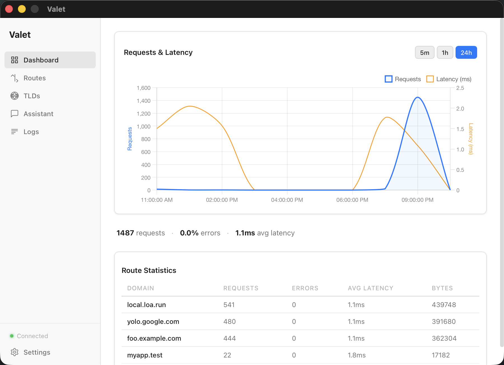
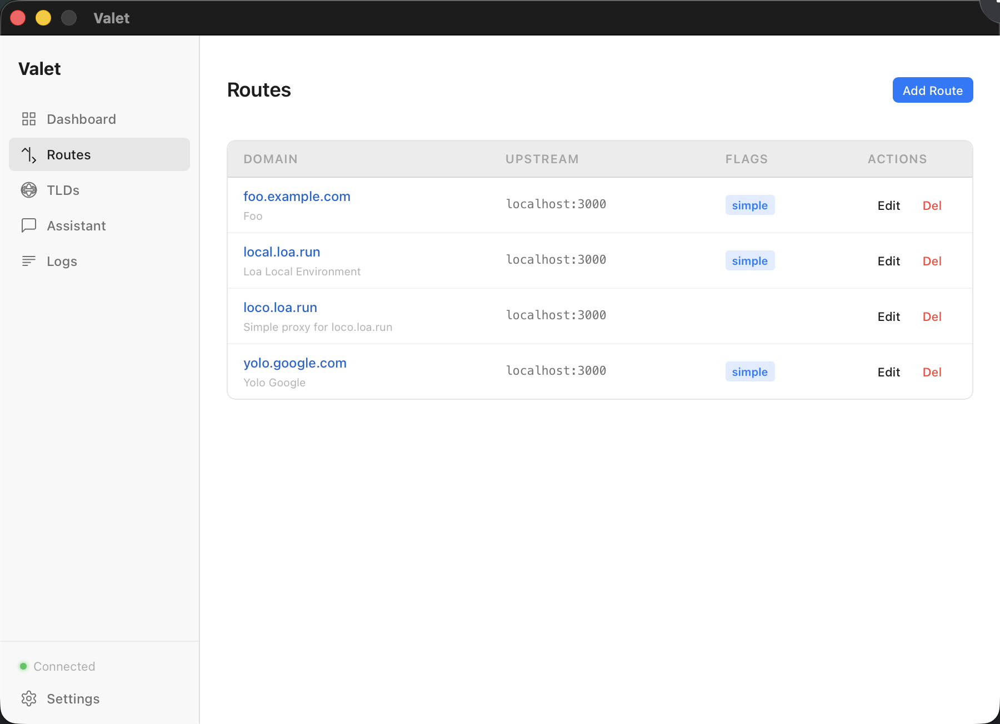
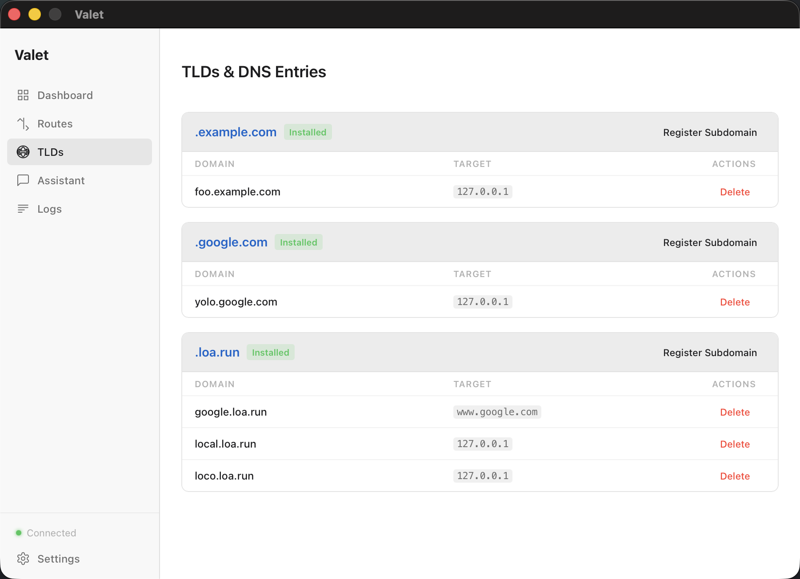
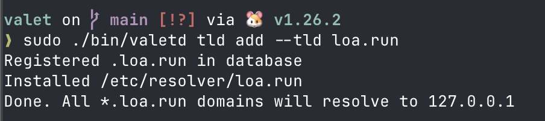
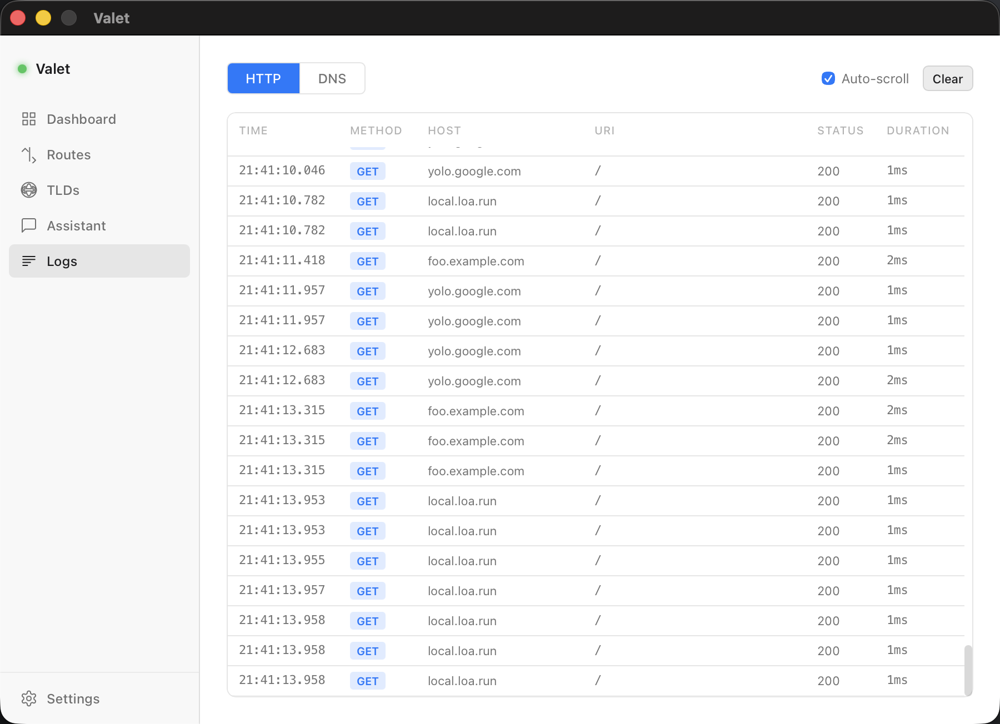
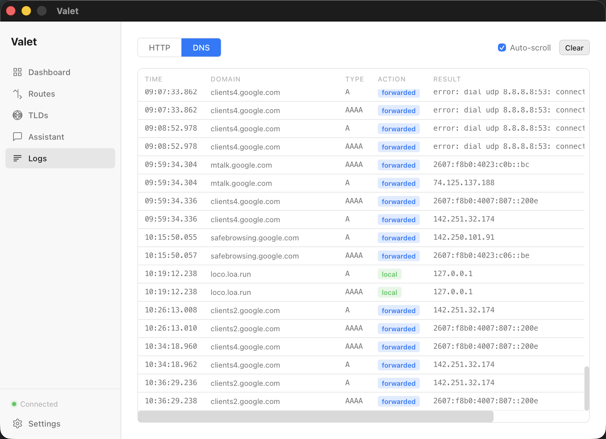

# Valet

> Stop gluing together mkcert, Caddy, and DNS configs in every repo. Valet does it once, for all your local services.



## The Problem

Every local dev project needs the same things: trusted HTTPS (so your browser doesn't scream at you), custom domain names (so cookies and CORS actually work), and a reverse proxy (so your frontend and API live on the same origin). You end up wiring together mkcert, Caddy, and `/etc/hosts` — then doing it again in the next project.

It gets worse when you have multiple services. They all want port 443. You need proxy rules, path routing, cert regeneration, DNS overrides. What should be a 5-minute setup turns into an hour of remembering Caddy config syntax, debugging certificate trust chains, and hand-editing hosts files.

## The Solution

Valet handles all of this in one place. Add a route, get a trusted cert, hit it in the browser. Every service gets its own domain on `:443` — no port conflicts, no `localhost:8080`.

- **Trusted HTTPS** — Automatic mkcert certificates trusted by your browser. No more `thisisunsafe`.
- **DNS override** — Point any domain to localhost. Swap a production API for a local one without touching your app config.
- **Reverse proxy** — Unify your frontend dev server and backend under a single domain. SPA + API routing in one click.
- **One port to rule them all** — All your services on `:443`, differentiated by hostname. No more remembering which port goes where.

What used to take hours of glue code is now minutes in a GUI or a single CLI command.

## Features

### Trusted HTTPS on Any Domain

Route traffic from custom domains to your local services with automatic mkcert certificates. No browser warnings, no self-signed cert hassles.



### Real-Time Metrics Dashboard

Watch your traffic in real-time with a live Chart.js chart, per-route statistics, and summary metrics. All data persists in SQLite across restarts.

### DNS Management

Register TLDs or override real domains — Valet runs a local DNS server that resolves your routes to localhost and forwards everything else to upstream DNS.



Register a TLD with one command:



### HTTP & DNS Log Viewer

See every request and DNS query flowing through Valet with live-updating log tables. Filter by route, toggle auto-scroll, clear when needed.





### AI Assistant

An in-app AI assistant powered by ADK that can manage routes, diagnose issues, and configure your entire setup through natural language. Works with Ollama, or any OpenAI-compatible endpoint.

### MCP Server for Claude Code

Valet exposes an MCP server so Claude Code can manage your proxy configuration directly from the terminal.

```json
{
  "mcpServers": {
    "valet": {
      "command": "valetd",
      "args": ["mcp"]
    }
  }
}
```

### And more...

- Route templates (SPA+API, WebSocket, CORS, load-balanced)
- 4 themes (macOS Dark, macOS Light, Nord, Rose Pine)
- A/CNAME record support for DNS entries
- Advanced routing with path rules, headers, compression
- Input validation (Zod + Go)
- Caddy config preview before saving

## Install

Download the latest DMG from [Releases](https://github.com/loaapp/valet/releases).

Or build from source:

```bash
make build
```

See [Building from Source](docs/building.md) for prerequisites and details.

## Quick Start

```bash
# Start the daemon
valetd

# Register a TLD with DNS resolver (one-time, requires sudo)
sudo valetd tld add --tld test

# Add a route
valet add myapp.test localhost:3000

# Visit https://myapp.test in your browser
```

## Documentation

- [Building from Source](docs/building.md)
- [DNS Configuration](docs/dns.md)
- [MCP Integration](docs/mcp.md)
- [Contributing](docs/contributing.md)

## License

MIT License. See [LICENSE.md](LICENSE.md) for details.
